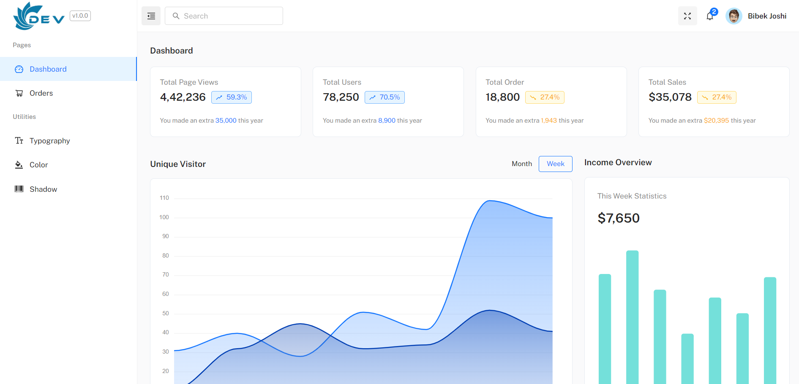

[](#license)

# What is IMS ?

This repository contains a base template for a CMS dashboard, designed to be a reusable starting point for other projects. Built with modern technologies, it incorporates essential tools and patterns for scalable and efficient development.

<br/>

<div align="center">

</div>

<br />

# Contributing to Project 🔐

Remember, Good PR makes you a Good contributor !

We work hard to maintain the structure, and [use conventional Pull](https://github.com/bibekjoshi01/ims-template/blob/main/CONTRIBUTING.md#pull-request-title-format-) request titles and commits. Without a proper template for the PR, not following the guidelines and spam might get the pull request closed, or banned.

## 1️. Setting up the project locally

1. Clone from Github

```
git clone https://github.com/bibekjoshi01/ims-template
```

2. Install packages

```
yarn
```

3. Run project

```
yarn start
```

---

### Features

- 🧱 Material UI v5 components with full customization.
- ⚛️ Built with React 19 and Hooks API.
- 🔁 Global state management via React Context API.
- 📡 Data fetching with SWR.
- 🚦 Routing using React Router v7.
- ⚡ Lightning-fast development experience with Vite.
- 🎨 CSS-in-JS via Emotion.
- 📦 Code splitting and optimized build.
- 📅 Integrated date pickers, charts, tables, and more.
- 💾 Persistent Redux store with `redux-persist`.
- 📚 Form handling with `react-hook-form` and `zod`.

---

### 🛠 Tech Stack

- **Framework**: React 19, Vite
- **UI Kit**: Material UI (MUI v5), Ant Design Icons
- **Routing**: React Router v7
- **State Management**: React Context, Redux Toolkit, Redux Persist
- **Forms**: React Hook Form, Zod
- **Charts**: ApexCharts
- **PDF/Excel**: jsPDF, jsPDF AutoTable, SheetJS (xlsx)
- **Data Grid**: MUI X Data Grid
- **Utilities**: Day.js, Lodash, File Saver, SWR
- **Styling**: Emotion, CSS-in-JS, Fontsource
- **Code Quality**: Prettier, Husky, Lint-Staged

---

## 2️. Contributing guidelines & more

- [Contributing Guidelines](/CONTRIBUTING.md) to be followed.
- [Proper API documentation](https://ims-backend.bibekjoshi34.com.np/docs/) for developers.

# License 👮

This is Licensed under the <a href="./LICENSE">Private License</a>. Please go through the License at least once before contributing.

# Support 🙏

**Don't forget to drop a star ⭐.** A heartfelt thank you to those who have contributed to this project. We are really grateful for your contribution. You all are amazing.
